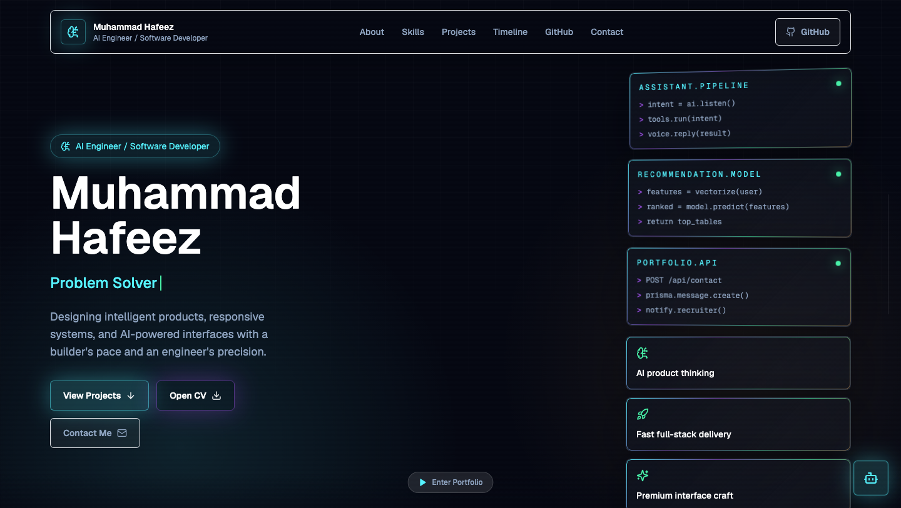
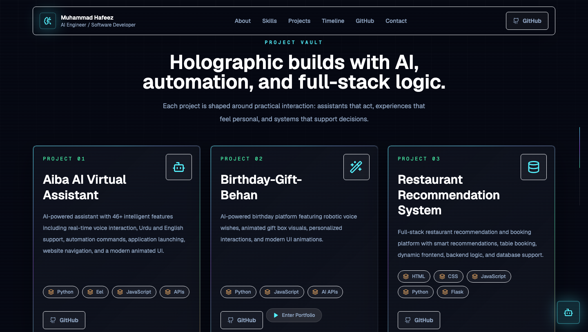

# Muhammad Hafeez

AI Engineer | Full-Stack Developer | Prompt Engineer | Virtual Assistant Developer

## About Me

I am Muhammad Hafeez, an AI Engineer and Software Developer focused on intelligent assistants, automation systems, and modern full-stack applications. I combine practical engineering with polished, responsive user experiences.

- AI Engineer and Software Developer at Decode Labs
- Based in Lahore and available for remote opportunities
- HND Software Engineering student at Pearson
- Diploma in Education IT from SEG Awards
- Portfolio: [muhammad-hafeez.vercel.app](https://muhammad-hafeez.vercel.app/)
- LinkedIn: [Muhammad Hafeez](https://www.linkedin.com/in/muhammad-hafeez-25b39b359)
- Instagram: [@sayedhafeez313](https://www.instagram.com/sayedhafeez313)
- Email: [haffeypythonista@gmail.com](mailto:haffeypythonista@gmail.com)

## Personal Portfolio

[Open My Live Portfolio](https://muhammad-hafeez.vercel.app/)

